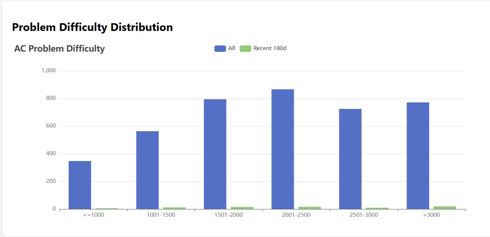
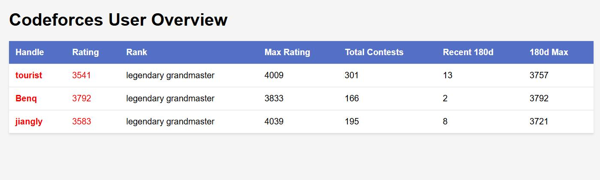
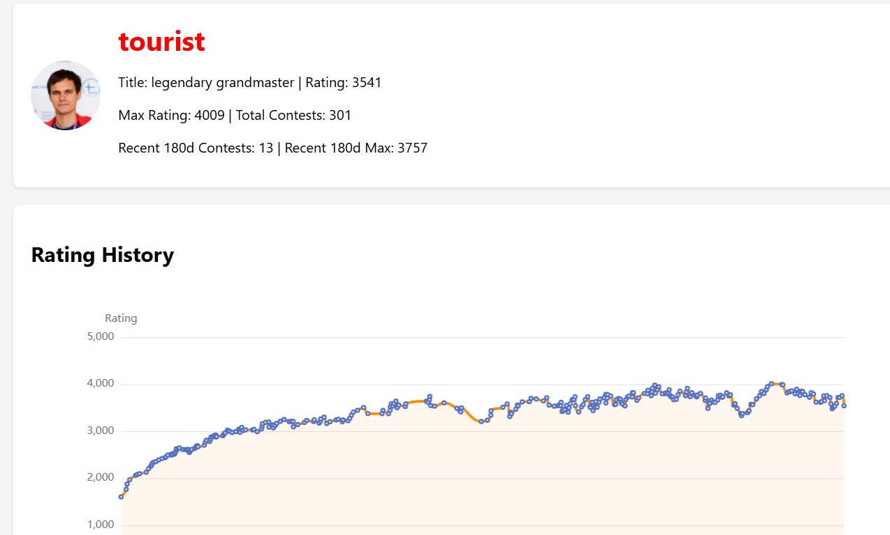

# Codeforces Analytics Pipeline

**Codeforces 用户数据采集 · 多维度统计分析 · 交互式可视化报告生成**

>湘潭大学 2026 春季学期 · 程序设计课程大作业 · 评分 **95/100**（优秀）

---

## 📌 项目简介

本项目基于 Codeforces 官方 API，构建了一套完整的**用户数据采集、分析与可视化管道**。系统支持单用户深度分析与多用户批量对比，自动抓取比赛记录与提交历史，生成交互式 HTML 可视化报告。

项目从课程大作业起步，在完成基础要求后，额外引入了**本地缓存机制**、**赛后补题判定**、**双窗口难度直方图**和**四层模块化架构重构**，将其从单文件脚本升级为具备工程化思维的**数据管道**。

---

## 🎯 核心功能

| 功能模块 | 说明 |
| :--- | :--- |
| **用户数据采集** | 支持交互式输入用户 ID，或通过 `users.txt` 批量读取 |
| **比赛记录抓取** | 获取比赛列表、参赛记录、排名、各题得分 |
| **提交记录分析** | 获取全部提交记录，**自动判定赛后补题**（表格中以 `✓` 标记） |
| **用户画像统计** | 当前 Rating、头衔、头像、比赛次数、最高 Rating、近 180 天数据 |
| **CF 官方着色** | 用户 ID 与 Rating 数值严格按 Codeforces 官方规则着色 |
| **比赛详情表格** | 按时间倒序展示赛事名称、赛前/赛后 Rating、排名、各题得分、补题标记 |
| **多用户对比** | 从 `users.txt` 批量生成个人报告与总览页 `index.html`，用户名可点击跳转 |
| **难度直方图** | 统计全部历史与近 180 天 AC 题目难度分布，双柱对比展示 |

---

## ⚡ 技术亮点

### 1. 本地缓存机制
首次抓取后，将原始 JSON 响应缓存到 `cache/` 目录，二次查询直接从本地读取。配合 `throttle()` 函数控制请求间隔 ≥ 2 秒，尊重 API 限流策略。

**效果**：`tourist` 的二次运行时间从 **6 分钟降至 20 秒**，降幅约 **95%**。

### 2. 赛后补题智能判定
通过分析用户的提交记录与比赛题目列表，自动标记赛后补题（表格中以 `✓` 直观展示），帮助用户追踪学习进度。

### 3. 模块化架构设计
原始代码为单文件实现，经重构后拆分为四层独立模块，职责分离，接口清晰：

```
main.cpp          # 程序入口，流程调度
api_client        # 网络层（libcurl 封装、限流、缓存）
data_parser       # 解析层（cJSON 封装）
statistics        # 统计层（近180天、难度直方图、补题判定）
html_render       # 渲染层（HTML 报告生成，ECharts图表集成）
utils             # 工具函数（颜色映射、时间格式化、缓存IO）
data_structures   # 数据结构定义
```

### 4. 跨平台编码兼容处理
针对 MSVC 环境下 UTF-8 编码的兼容性问题，采用 UTF-8 BOM 写入策略，确保生成的 HTML 报告在任意浏览器中均可正确显示中文内容。

### 5. API 限流与错误处理
- `throttle()` 保证请求间隔 ≥ 2s
- 所有 cJSON 解析均进行空值检查，避免因 API 响应异常导致程序崩溃

---

## 🧱 项目结构

```
Codeforces Analytics Pipeline/
├── main.cpp              # 程序入口，流程调度
├── api_client.h/cpp      # 网络层（libcurl 封装、限流、缓存）
├── data_parser.h/cpp     # 解析层（cJSON 封装）
├── statistics.h/cpp      # 统计层（近180天、难度直方图、补题判定）
├── html_render.h/cpp     # 渲染层（HTML 报告生成，ECharts图表集成）
├── utils.h/cpp           # 工具函数（颜色映射、时间格式化、缓存IO）
├── data_structures.h     # 数据结构定义
├── third_party/          # 第三方库（cJSON）
├── libs/                 # libcurl 库文件
└── users.txt             # 多用户输入样例
```

---

## 🔧 开发环境

| 类别 | 技术 |
| :--- | :--- |
| 语言 | C++17 |
| 编译器 | MSVC (Visual Studio 2022) |
| 网络库 | libcurl |
| JSON 解析 | cJSON |
| 可视化 | ECharts (HTML 报告内嵌) |
| 构建工具 | Visual Studio 解决方案 (.sln) |

---

## 🚀 快速开始

### 前置条件
- Windows 10/11
- Visual Studio 2022（含 C++ 桌面开发组件）

### 构建与运行

```bash
# 1. 克隆仓库
git clone https://github.com/Paliviva/Codeforces-Analytics-Pipeline.git

# 2. 用 Visual Studio 2022 打开 CodeforcesAnalytics.sln

# 3. 确认包含目录与库目录已正确指向 third_party 和 libs

# 4. 编译运行 (Ctrl + F5)，按提示选择模式
```

---

## 📷 运行截图

### 单用户报告



### 多用户总览



### 难度直方图


---

## 📋 未来计划

- [ ] 将数据存储迁移至 MySQL，支持持久化与复杂查询
- [ ] 引入调度工具（如 cron），实现每日自动抓取与增量更新
- [ ] 尝试用简单模型预测下一场 Rating 变化
- [ ] 将数据管道搬上 Web，做成在线分析平台

---

## 📄 许可说明

本项目为课程作业成果，仅供学习参考使用。
 
